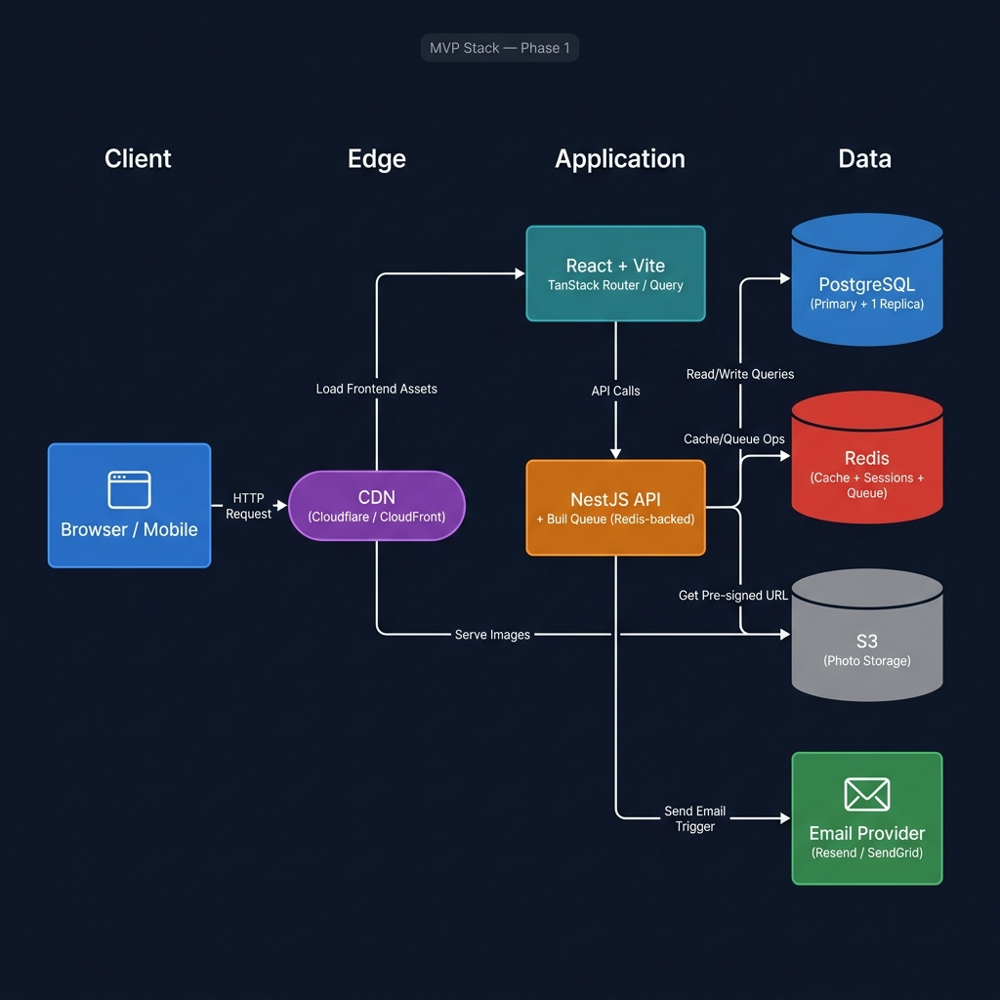
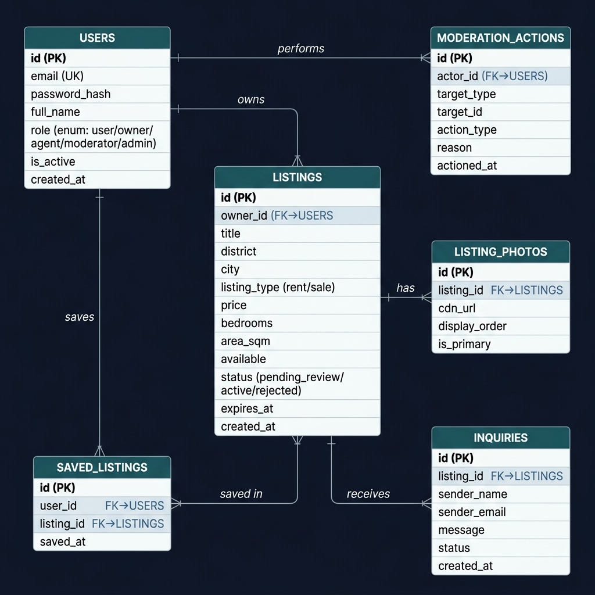

# Real Estate Marketplace — MVP Design

> **Scope**: This document covers only what ships in **Phase 1 (MVP)**.
> Full production architecture, scaling plan, and future phases are in [`system_design.md`](./system_design.md).

---

## 1. What the MVP Delivers

The MVP establishes the core marketplace loop: **list → discover → inquire**, with just enough trust & safety (basic moderation) to go live responsibly.

| # | Feature | Why it's in MVP |
|---|---------|-----------------|
| 1 | User registration & login (email/password) | Gate on every other feature |
| 2 | Listing creation with photo upload | Core product value — no listing, no marketplace |
| 3 | Basic moderation queue | Required for trust before going live |
| 4 | Listing search (PostgreSQL FTS) | Fast to ship; sufficient at launch scale (< 50k listings) |
| 5 | Listing detail page | Drives organic discovery |
| 6 | Saved listings (wishlist) | Low effort, high retention value |
| 7 | Inquiry form → email notification | Monetisation path; connects buyer to agent |

---

## 2. What Is Deferred

| Feature | Why deferred |
|---------|-------------|
| OAuth (Google/Facebook) | Adds complexity without blocking launch |
| Elasticsearch / OpenSearch | Not needed until > 50k active listings |
| In-app messaging / chat | Email-based inquiries are sufficient for MVP |
| Geospatial / map search | Requires PostGIS or Elasticsearch; Phase 2 |
| Automated spam scoring ML model | Manual moderation is sufficient at small scale |
| Multi-region deployment | Not justified until cross-country user base |
| Mobile apps (iOS/Android) | Responsive React SPA covers mobile browsers |
| Agent license API verification | Manual review queue acceptable in Phase 1 |
| Separate dedicated workers fleet | Bull queue runs inside the NestJS process |
| Elasticsearch CDC pipeline | PostgreSQL FTS with indexes is the search engine |

---

## 3. MVP Tech Stack

| Layer | Technology | Notes |
|-------|-----------|-------|
| Frontend | **React 19 + Vite** · TanStack Router · TanStack Query | SPA served from CDN |
| Backend API | **NestJS** (TypeScript) | Single deployable service |
| Async jobs | **Bull** (Redis-backed) | Runs in-process; no separate worker fleet |
| Primary DB | **PostgreSQL** (RDS `db.t3.medium`) | 1 read replica |
| Cache / sessions / queue | **Redis** (ElastiCache `cache.t3.micro`) | Shared for all three uses |
| Photo storage | **S3-compatible** bucket | Pre-signed upload URLs; CDN-fronted |
| Email | **Resend / SendGrid** | Inquiry notifications only |
| Deployment | **Railway / Render / AWS ECS Fargate** | Single-service PaaS; no Kubernetes |
| Monitoring | **Structured JSON logs** + basic uptime alert | Full Prometheus/Grafana in Phase 2 |

---

## 4. Architecture



### How it works

1. **Browser** hits CDN → CDN serves the static React app from edge cache.
2. React app bootstraps; **TanStack Router** handles client-side routing.
3. **TanStack Query** fetches data from the NestJS REST API (`/api/v1/...`); it caches responses in memory and refetches stale data in the background.
4. **NestJS API** is the single backend process — it handles auth, business logic, and queues async jobs (email dispatch, photo processing) through **Bull** backed by Redis.
5. **Redis** serves triple duty: response cache (listing detail TTL 5 min), rate-limit counters, and Bull job queue.
6. **Photos** are uploaded client-side via S3 pre-signed PUT URLs — the API never touches the binary data.
7. **CDN** serves all processed photo WebP files directly from S3.
8. **PostgreSQL FTS** handles all search queries via composite + GIN indexes.

---

## 5. Database Design

Six tables are needed for the MVP. `AGENTS` and `VERIFICATION_RECORDS` from the full design are **deferred** — agents use the owner role for now, and moderation is manual through the admin interface.



### Table notes

| Table | Key design decision |
|-------|-------------------|
| `USERS` | `role` enum column: `user / owner / agent / moderator / admin`. Single column is sufficient for 5 fixed roles. |
| `LISTINGS` | `status` enum: `pending_review → active → rejected / expired`. `expires_at` drives the daily stale-listing cron. |
| `LISTING_PHOTOS` | `is_primary` flag; `display_order` for drag-and-drop reorder. Max 30 per listing enforced at API layer. |
| `SAVED_LISTINGS` | Unique constraint on `(user_id, listing_id)`; upsert with `ON CONFLICT DO NOTHING` for idempotency. |
| `INQUIRIES` | No `sender_id` FK — anonymous inquiries are allowed. Email stored directly for notification dispatch. |
| `MODERATION_ACTIONS` | Polymorphic log (`target_type + target_id`); append-only immutable audit trail. |

### Key indexes

```sql
-- Fast filtered search (the main query path)
CREATE INDEX idx_listings_search
ON listings (listing_type, district, price, bedrooms)
WHERE status = 'active' AND available = TRUE;

-- Full-text search on title + description
CREATE INDEX idx_listings_fts
ON listings USING gin(to_tsvector('english', title || ' ' || description));

-- Wishlist lookups
CREATE UNIQUE INDEX idx_saved_listings_user_listing
ON saved_listings (user_id, listing_id);

-- Stale-listing cron
CREATE INDEX idx_listings_expires
ON listings (expires_at)
WHERE status = 'active';
```

---

## 6. API Endpoints

Auth: **JWT** (15 min access token) + **HTTP-only refresh token** (7 days), rotated on each refresh.

### Authentication

```
POST /api/v1/auth/register    — create account
POST /api/v1/auth/login       — get tokens
POST /api/v1/auth/refresh     — rotate refresh token
POST /api/v1/auth/logout      — revoke refresh token
```

### Listings

| Method | Path | Auth | Description |
|--------|------|------|-------------|
| `GET` | `/api/v1/listings` | Public | Search with filters + cursor pagination |
| `GET` | `/api/v1/listings/:id` | Public | Full listing detail |
| `POST` | `/api/v1/listings` | Owner / Agent | Create listing → `pending_review` |
| `PATCH` | `/api/v1/listings/:id` | Owner (own) | Update listing fields |
| `DELETE` | `/api/v1/listings/:id` | Owner (own) | Soft-delete / unpublish |
| `POST` | `/api/v1/listings/:id/photos/upload-url` | Owner (own) | Get pre-signed S3 PUT URL |

**Search query params**: `listing_type` · `district` · `city` · `min_price` · `max_price` · `min_bedrooms` · `only_available` · `cursor` · `limit`

### Saved Listings

```
GET    /api/v1/saved-listings          — user's wishlist
POST   /api/v1/saved-listings          — save { listing_id }  (idempotent)
DELETE /api/v1/saved-listings/:id      — un-save
```

### Inquiries

```
POST  /api/v1/inquiries                — send inquiry (rate-limited: 5/min per IP)
GET   /api/v1/listings/:id/inquiries   — owner/agent view their inbox
```

### Moderation (Moderator / Admin only)

```
GET    /api/v1/moderation/queue        — pending listings
POST   /api/v1/moderation/:listingId/approve
POST   /api/v1/moderation/:listingId/reject   — body: { reason }
POST   /api/v1/moderation/actions             — log a moderation action
```

---

## 7. Core Workflows

### Listing Creation

```
Owner/Agent fills form
    │
    ▼
POST /listings   →   Validate fields
    │
    ├─ Insert into DB (status: pending_review)
    ├─ Return pre-signed S3 upload URL(s)
    │
    ▼
Client uploads photos directly to S3
    │
    ▼
Bull job: process image → WebP variants → write listing_photos row
    │
    ▼
Listing appears in moderation queue
```

### Moderation

```
Moderator opens queue (/moderation/queue)
    │
    ├─ Approve → status: active  → listing appears in search
    └─ Reject  → status: rejected → owner notified by email
```

### Search

```
GET /listings?listing_type=rent&district=Thao+Dien&max_price=1500&min_bedrooms=2
    │
    ├─ Check Redis cache (key: hash of query params, TTL: 60s)
    ├─ Cache hit  → return immediately
    └─ Cache miss → PostgreSQL FTS query → cache result → return
```

### Inquiry Flow

```
User submits inquiry form
    │
    ├─ Rate-limit check (5/min per IP, 20/day per email)
    ├─ Insert inquiries row
    │
    ▼
Bull job: send email to owner/agent via Resend/SendGrid
```

---

## 8. Search Implementation

```sql
-- Example query for: rent listings in "Thao Dien", max $1500, min 2 bedrooms
SELECT
    id, title, district, price, bedrooms, area_sqm,
    (SELECT cdn_url FROM listing_photos
     WHERE listing_id = l.id AND is_primary = TRUE LIMIT 1) AS primary_photo_url
FROM listings l
WHERE
    status    = 'active'
    AND available     = TRUE
    AND listing_type  = 'rent'
    AND LOWER(district) = LOWER('Thao Dien')
    AND price         <= 1500
    AND bedrooms      >= 2
    AND id < :cursor          -- cursor-based pagination
ORDER BY id DESC
LIMIT 21;                     -- fetch 21; if 21 returned, has_more = true
```

**Why cursor over offset**: Offset pagination is unstable when new listings are inserted between pages. Cursor on `id DESC` gives consistent results at negligible cost.

---

## 9. Photo Upload Flow

```
1. POST /listings/:id/photos/upload-url
       → API validates ownership
       → API calls S3 GeneratePresignedUrl (PUT, 15 min TTL, max 20 MB)
       → returns { upload_url, storage_key }

2. Client PUTs file directly to S3 (no API involvement)

3. S3 ObjectCreated event → Bull job enqueued

4. Bull job:
       → Validate MIME type (jpeg/png/webp only)
       → Sharp: resize to 1200px / 800px / 400px WebP + 200px thumbnail
       → Write listing_photos row (cdn_url = CDN_BASE + storage_key)

5. CDN serves all sizes with Cache-Control: public, max-age=31536000, immutable
```

---

## 10. Security

| Concern | MVP approach |
|---------|-------------|
| Authentication | JWT (15 min) + HTTP-only refresh (7 days), rotated on use |
| Password storage | bcrypt cost factor 12 |
| Authorization | `RolesGuard` on every protected endpoint; ownership check on mutations |
| Input validation | `class-validator` DTOs; parameterized queries via TypeORM (no raw SQL injection risk) |
| Rate limiting | `@nestjs/throttler` + Redis store — 100 req/min global, 5/min on inquiry submission |
| Transport | TLS 1.3; HSTS on the SPA |
| Secrets | Environment variables via platform secret store (never committed) |
| CORS | Allowlist to SPA origin only |

---

## 11. Basic Observability

The MVP doesn't run a full Prometheus stack — that's Phase 2. Instead:

- **Structured JSON logs** to stdout from every NestJS request (timestamp, level, trace_id, method, path, status_code, duration_ms).
- **Platform uptime monitoring** (Railway/Render built-in, or UptimeRobot) with PagerDuty/Slack alert on 5xx spike or downtime.
- **Redis Bull dashboard** (Bull Board) for monitoring job queue depth and failures.
- **RDS CloudWatch alarms** on CPU > 80% and free storage < 20%.

---

## 12. MVP Infrastructure sizing

| Resource | Size | Monthly est. cost (AWS) |
|----------|------|------------------------|
| ECS Fargate (NestJS) | 0.5 vCPU / 1 GB RAM | ~$15 |
| RDS PostgreSQL `db.t3.medium` | 2 vCPU / 4 GB RAM | ~$50 |
| ElastiCache `cache.t3.micro` | 1 vCPU / 0.555 GB | ~$12 |
| S3 storage | 100 GB | ~$3 |
| CloudFront CDN | 1 TB transfer | ~$85 |
| **Total estimate** | | **~$165/month** |

> Costs drop by ~40% on Railway/Render PaaS for early-stage (simpler ops, slightly less control).

---

## 13. When to move on from MVP

| Signal | Action |
|--------|--------|
| API CPU > 70% sustained | Scale out ECS tasks; extract Bull workers to separate service |
| Search p95 > 500 ms | Introduce Elasticsearch; set up CDC pipeline |
| Listing count > 50k | Migrate search to Elasticsearch |
| DB write IOPS > 80% | Add read replicas; consider connection pooling via PgBouncer |
| DLQ jobs accumulate | Extract Bull workers to dedicated auto-scaling fleet |
| 5xx rate > 1% | Instrument full Prometheus + Grafana stack |

Full architecture for each phase is documented in [`system_design.md §13`](./system_design.md).
