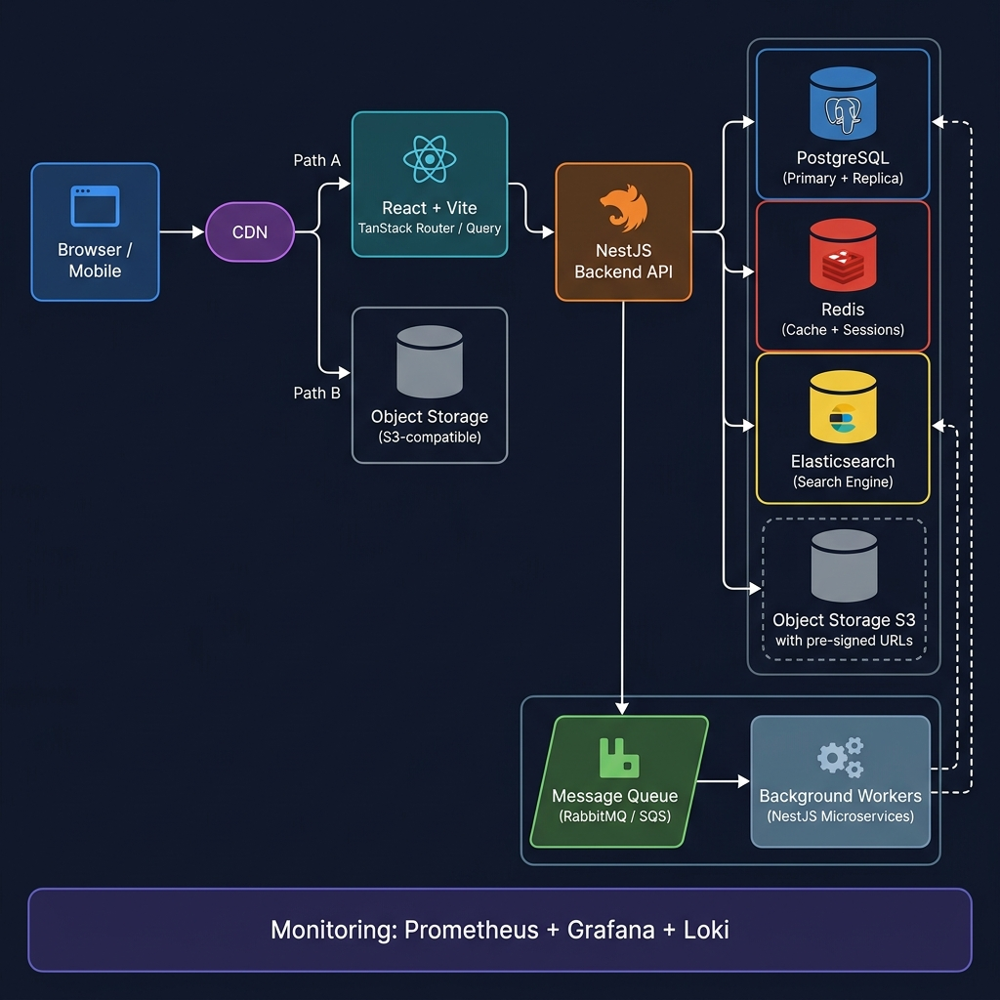
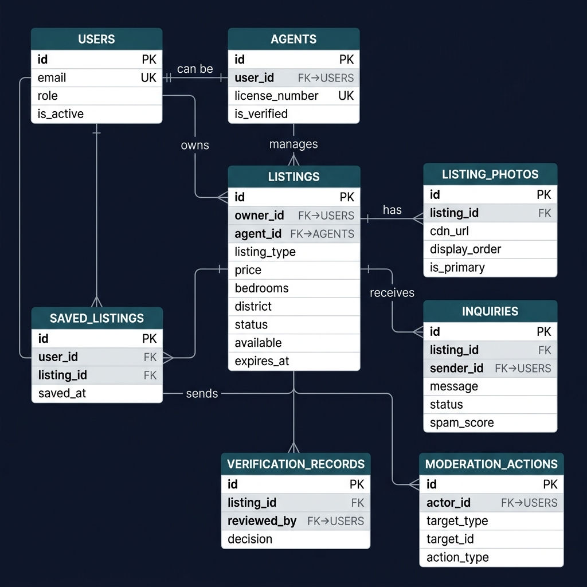

# Real Estate Marketplace — System Design

---

## 1. Requirements

### Functional Requirements

| # | Requirement |
|---|-------------|
| F-1 | Users can register and log in with email/password or OAuth (Google, Facebook). |
| F-2 | Agents and property owners can create, edit, publish, and unpublish listings. |
| F-3 | Listings include photos, description, price, location, listing type (rent/sale), bedrooms, area, and availability. |
| F-4 | Buyers and renters can search listings by location, district, price range, bedrooms, property type, and availability. |
| F-5 | Users can view a detailed listing page including photos, agent contact, and a map pin. |
| F-6 | Authenticated users can save/un-save listings to a personal wishlist. |
| F-7 | Buyers/renters can send inquiries to agents or owners via an in-app messaging flow. |
| F-8 | New listings enter a verification queue; moderators approve or reject them. |
| F-9 | Moderators can flag, hide, or remove listings and suspend accounts. |
| F-10 | Admins can manage user roles, view platform analytics, and configure system settings. |
| F-11 | Stale or expired listings are automatically unpublished after a configurable TTL. |

### Non-Functional Requirements

| # | Requirement | Target |
|---|-------------|--------|
| NF-1 | Availability | 99.9% uptime (≤ 8.7 h downtime/year) |
| NF-2 | Search latency | p95 < 300 ms for listing searches |
| NF-3 | Detail page latency | p95 < 200 ms (cached) |
| NF-4 | Photo upload | Support images up to 20 MB each; max 30 per listing |
| NF-5 | Scalability | Handle current 500k visitors/month; design for 10× growth |
| NF-6 | Security | OWASP Top 10 compliance; encrypted data at rest and in transit |
| NF-7 | Observability | Logs, metrics, and distributed traces for all services |
| NF-8 | Compliance | GDPR-compliant data handling; right-to-erasure support |

---

## 2. User Roles

| Role | Description | Key Capabilities |
|------|-------------|------------------|
| **Buyer** | Searches for properties to purchase | Search, view, save listings, send inquiries |
| **Renter** | Searches for properties to rent | Search, view, save listings, send inquiries |
| **Agent** | Licensed real estate professional | All of buyer/renter + create/manage listings on behalf of owners |
| **Property Owner** | Individual owner listing their own property | Create/manage their own listings, view inquiries |
| **Moderator** | Internal trust & safety staff | Review pending listings, flag content, suspend accounts |
| **Admin** | Platform administrator | Full access: role management, system config, analytics dashboard |

---

## 3. Core Workflows

### 3.1 Listing Creation

1. Agent/Owner submits listing form (details + photos).
2. API validates input; photos are uploaded to Object Storage via a pre-signed URL.
3. Listing is persisted in PostgreSQL with status `pending_review`.
4. A `listing.created` event is published to the queue.
5. Moderation service consumes the event and places the listing in the review queue.

### 3.2 Listing Verification

1. Moderator opens the pending listing in the admin dashboard.
2. Moderator approves → status changes to `active`; a `listing.approved` event triggers search index update.
3. Moderator rejects → status set to `rejected`; owner/agent is notified with the rejection reason.
4. If no action is taken within 48 h, a reminder notification is sent to moderators.

### 3.3 Search

1. User submits search query with filters.
2. API validates parameters and routes to the Search Engine (Elasticsearch/OpenSearch in Phase 2+, PostgreSQL in Phase 1 MVP).
3. Results are returned paginated with cursor-based pagination; the response includes IDs, summary fields, and thumbnail URLs.
4. Popular queries are cached in Redis with a short TTL (60 s).

### 3.4 Detail Page

1. Client requests `GET /listings/{id}`.
2. API checks Redis for a cached response (TTL: 5 min).
3. On cache miss, API fetches from PostgreSQL, assembles the response (listing + photos + agent info), writes to cache, and returns.
4. Photo URLs are CDN-signed URLs with limited expiry to prevent hotlinking.

### 3.5 Saved Listings

1. Authenticated user clicks "Save".
2. API inserts a `saved_listings` row (user_id + listing_id) — idempotent via `ON CONFLICT DO NOTHING`.
3. Unsave: soft-delete row.
4. `GET /saved-listings` returns the user's wishlist with full listing summaries.

### 3.6 Inquiry Flow

1. User submits an inquiry form on a listing detail page.
2. API creates an `inquiries` record and publishes an `inquiry.created` event.
3. Email/push notification service consumes the event and notifies the agent/owner.
4. Spam scoring middleware runs asynchronously; high-score inquiries are flagged.

### 3.7 Moderation Flow

1. Moderator views a listing, photo, or user flagged as suspicious.
2. Moderator records a `moderation_actions` entry with action type and notes.
3. Action is applied: listing hidden, account suspended, etc.
4. All moderation actions are immutable audit log entries.

---

## 4. High-Level Architecture



### Component Responsibilities

| Component | Responsibility |
|-----------|---------------|
| **React + Vite (TanStack)** | Single-page application built with React 19 + Vite. TanStack Router handles client-side routing with file-based routes; TanStack Query manages all server state (fetching, caching, background refetch, optimistic updates). Static assets served from CDN. |
| **NestJS Backend API** | REST API gateway — authentication, request validation, business logic orchestration, rate limiting, caching façade. |
| **PostgreSQL** | Source of truth for all structured data. Primary handles writes; read replica offloads search queries in Phase 1. |
| **Redis** | Cache layer for listing detail pages and popular search results; distributed rate-limit counters; session store. |
| **Object Storage (S3)** | Durable storage for listing photos and documents. Clients upload directly via pre-signed URLs; the API never proxies binary data. |
| **Search Engine** | Full-text and geospatial search over listings; supports complex filter combinations with sub-300 ms latency at scale. |
| **Message Queue** | Decouples producers (API) from consumers (workers). Handles listing indexing, notification dispatch, fraud scoring, and stale-listing cleanup. |
| **Background Workers** | Long-running consumers for async tasks; isolated so failures do not affect the API response path. |
| **Monitoring Stack** | Prometheus scrapes metrics from all services; Grafana dashboards and alert rules; Loki for structured log aggregation; Tempo / Jaeger for distributed tracing. |

---

## 5. Database Design

### Entity-Relationship Diagram



### Relationship Notes

- **USERS → AGENTS**: One-to-one optional; a user may be promoted to an Agent role, which creates an `agents` record linking back to the user.
- **LISTINGS → USERS / AGENTS**: A listing is always owned by a user; optionally managed by an agent (e.g., acting on behalf of the owner).
- **SAVED_LISTINGS**: Many-to-many between users and listings; a unique constraint on `(user_id, listing_id)` ensures idempotency.
- **VERIFICATION_RECORDS**: One listing can have multiple records over its lifetime (re-submitted after rejection).
- **MODERATION_ACTIONS**: Polymorphic via `target_type + target_id`; records actions against listings, users, or inquiries without separate join tables.

---

## 6. API Design

All endpoints are versioned under `/api/v1`. Authentication uses short-lived JWT access tokens (15 min) plus HTTP-only refresh tokens (7 days).

---

### `POST /api/v1/listings`

**Create a new listing (Agent or Owner only)**

**Request**
```json
{
  "title": "Spacious 2BR Apartment in Thao Dien",
  "district": "Thao Dien",
  "city": "Ho Chi Minh City",
  "listing_type": "rent",
  "price": 1400,
  "bedrooms": 2,
  "bathrooms": 2,
  "area_sqm": 78,
  "description": "Bright apartment with river view..."
}
```

**Response — 201 Created**
```json
{
  "id": "550e8400-e29b-41d4-a716-446655440000",
  "status": "pending_review",
  "photo_upload_urls": [
    {
      "upload_url": "https://s3.example.com/listings/550e8400.../photo_1?X-Amz-Signature=...",
      "storage_key": "listings/550e8400.../photo_1"
    }
  ],
  "created_at": "2026-05-31T04:00:00Z"
}
```

---

### `GET /api/v1/listings`

**Search / filter listings (public)**

**Query Parameters**

| Parameter | Type | Description |
|-----------|------|-------------|
| `listing_type` | `rent` \| `sale` | Required |
| `district` | string | Case-insensitive |
| `city` | string | |
| `min_price` | number | |
| `max_price` | number | |
| `min_bedrooms` | integer | |
| `only_available` | boolean | Default: `true` |
| `cursor` | string | Opaque cursor for pagination |
| `limit` | integer | Default: 20, max: 50 |

**Response — 200 OK**
```json
{
  "data": [
    {
      "id": "550e8400-...",
      "title": "Spacious 2BR Apartment in Thao Dien",
      "district": "Thao Dien",
      "listing_type": "rent",
      "price": 1400,
      "bedrooms": 2,
      "area_sqm": 78,
      "available": true,
      "primary_photo_url": "https://cdn.example.com/listings/.../primary.webp"
    }
  ],
  "pagination": {
    "next_cursor": "eyJpZCI6IjU1MGU4...",
    "has_more": true
  }
}
```

---

### `GET /api/v1/listings/{id}`

**Fetch full listing detail (public)**

**Response — 200 OK**
```json
{
  "id": "550e8400-...",
  "title": "Spacious 2BR Apartment in Thao Dien",
  "description": "Bright apartment with river view...",
  "district": "Thao Dien",
  "city": "Ho Chi Minh City",
  "listing_type": "rent",
  "price": 1400,
  "bedrooms": 2,
  "bathrooms": 2,
  "area_sqm": 78,
  "available": true,
  "status": "active",
  "photos": [
    { "url": "https://cdn.example.com/.../photo_1.webp", "is_primary": true }
  ],
  "agent": {
    "id": "...",
    "full_name": "Nguyen Van A",
    "phone": "+84901234567",
    "agency_name": "ABC Realty"
  },
  "created_at": "2026-05-31T04:00:00Z",
  "updated_at": "2026-05-31T04:00:00Z"
}
```

**Error — 404 Not Found**
```json
{ "error": "listing_not_found", "message": "No listing found with the given ID." }
```

---

### `POST /api/v1/saved-listings`

**Save a listing (authenticated users only)**

**Request**
```json
{ "listing_id": "550e8400-..." }
```

**Response — 201 Created**
```json
{ "id": "...", "listing_id": "550e8400-...", "saved_at": "2026-05-31T04:00:00Z" }
```

**Idempotent**: Re-saving an already-saved listing returns `200 OK` with the existing record.

---

### `POST /api/v1/inquiries`

**Send an inquiry to an agent/owner (public, rate-limited)**

**Request**
```json
{
  "listing_id": "550e8400-...",
  "sender_name": "Tran Thi B",
  "sender_email": "b@example.com",
  "sender_phone": "+84987654321",
  "message": "Is this apartment still available from July?"
}
```

**Response — 202 Accepted**
```json
{
  "id": "...",
  "status": "pending",
  "message": "Your inquiry has been submitted and the agent will be notified."
}
```

---

## 7. Search Strategy

### Phase 1 — PostgreSQL Only (MVP)

Use a composite index and full-text search built into PostgreSQL:

```sql
-- Partial index for active rent/sale listings
CREATE INDEX idx_listings_search
ON listings (listing_type, district, price, bedrooms)
WHERE status = 'active' AND available = TRUE;

-- Full-text index on title + description
CREATE INDEX idx_listings_fts
ON listings USING gin(to_tsvector('english', title || ' ' || description));
```

**Pros**: Zero additional infrastructure; simple operational model.  
**Cons**: District matching is exact-string; geospatial search is limited; performance degrades beyond ~200k rows with complex filter combinations.

---

### Phase 2 — Elasticsearch / OpenSearch

Introduce a dedicated search cluster synced from PostgreSQL via CDC (Change Data Capture with Debezium) or worker-based event consumption.

**Index mapping highlights**:
```json
{
  "mappings": {
    "properties": {
      "listing_type": { "type": "keyword" },
      "district":     { "type": "keyword" },
      "price":        { "type": "float" },
      "bedrooms":     { "type": "integer" },
      "area_sqm":     { "type": "float" },
      "available":    { "type": "boolean" },
      "location":     { "type": "geo_point" },
      "title":        { "type": "text", "analyzer": "standard" },
      "description":  { "type": "text", "analyzer": "standard" }
    }
  }
}
```

**Supported filters**: exact match on `listing_type`, `district`; range on `price`, `bedrooms`, `area_sqm`; geospatial radius search; full-text on `title`/`description`.

### Tradeoffs

| Dimension | PostgreSQL | Elasticsearch |
|-----------|-----------|---------------|
| Operational complexity | Low | Medium–High |
| Query flexibility | Medium | High |
| Geospatial support | Limited (PostGIS extension) | Native |
| Relevance ranking | Basic (`ts_rank`) | Advanced (BM25 + custom scoring) |
| Infra cost | Already present | Additional cluster cost |
| Data consistency | Immediate | Eventually consistent (seconds lag) |

**Decision**: Start with PostgreSQL. Migrate to Elasticsearch when: (a) p95 search latency exceeds 500 ms, or (b) listing count exceeds 500k active records.

---

## 8. Media Handling

### Upload Flow

1. Client requests a pre-signed upload URL from `POST /api/v1/listings/{id}/photos/upload-url`.
2. API generates a time-limited (15 min) S3 pre-signed PUT URL and returns it.
3. Client uploads the image directly to S3 — the API never handles binary data.
4. S3 emits a `s3:ObjectCreated` event; a Lambda (or worker) triggers image processing:
   - Validation: mime type, max size (20 MB), dimensions sanity check.
   - Transcoding: generate WebP versions at 1200px, 800px, 400px.
   - Thumbnail: 200×150 px for listing cards.
5. Worker writes `listing_photos` record with `cdn_url` pointing to CDN-fronted path.

### Storage

- **Bucket structure**: `listings/{listing_id}/{photo_id}/{size}.webp`
- **Lifecycle policy**: Delete originals after 24 h; retain processed versions indefinitely (or until listing is permanently deleted).
- **Redundancy**: Multi-AZ bucket replication (S3 CRR or equivalent).

### CDN

- Serve all processed images through a CDN edge (CloudFront or Cloudflare).
- Cache-Control: `public, max-age=31536000, immutable` for versioned photo paths.
- Signed URLs with a 1 h expiry for private/draft listing photos.

### Photo Moderation

- Automated: route every uploaded image through a content moderation API (AWS Rekognition or equivalent) to detect explicit content.
- Images flagged with confidence > 80% are held for human review.
- Manual: moderators can remove individual photos; removal cascades to CDN cache invalidation.

---

## 9. Security & Permissions

### RBAC Model

```
admin > moderator > agent > owner > user (buyer/renter)
```

Roles are stored in the `users.role` column and enforced by a NestJS `RolesGuard` decorator on every protected endpoint.

### Permission Matrix

| Action | user | owner | agent | moderator | admin |
|--------|:----:|:-----:|:-----:|:---------:|:-----:|
| View active listings | ✅ | ✅ | ✅ | ✅ | ✅ |
| Save listings | ✅ | ✅ | ✅ | ✅ | ✅ |
| Send inquiries | ✅ | ✅ | ✅ | — | — |
| Create listing | — | ✅ | ✅ | — | ✅ |
| Edit own listing | — | ✅ | ✅ | — | ✅ |
| Delete own listing | — | ✅ | ✅ | — | ✅ |
| Review pending listings | — | — | — | ✅ | ✅ |
| Moderate any listing | — | — | — | ✅ | ✅ |
| Suspend user accounts | — | — | — | ✅ | ✅ |
| Manage roles | — | — | — | — | ✅ |
| View platform analytics | — | — | — | — | ✅ |

### Additional Security Measures

- **Transport**: TLS 1.3 everywhere; HSTS preloading on the web app.
- **Authentication**: JWT with short TTL; refresh tokens rotated on each use and stored HTTP-only.
- **Password storage**: bcrypt with cost factor 12.
- **Input validation**: class-validator on every DTO; parameterized queries (TypeORM) prevent SQL injection.
- **CORS**: Strict allowlist; no wildcard origins in production.
- **Secrets management**: Secrets stored in AWS Secrets Manager / HashiCorp Vault; never in environment files committed to source control.

---

## 10. Reliability

### Caching

- **Redis** caches listing detail pages (TTL: 5 min) and popular search queries (TTL: 60 s).
- Cache is invalidated on listing update or status change via a targeted `DEL` on the affected key.
- Cache stampede prevention: use a probabilistic early expiry (PER algorithm) or a single-flight mutex.

### Rate Limiting

- Global: 100 req/min per IP on all public endpoints (Redis token-bucket counter).
- Inquiry submission: 5 req/min per IP + 20/day per email, to prevent spam.
- Authentication endpoints: 10 req/min per IP with progressive backoff.

### Retries & Circuit Breakers

- All inter-service HTTP calls (e.g., email provider, moderation API) use exponential backoff with jitter (max 3 retries).
- NestJS uses `@nestjs/axios` with a `HttpService` wrapped by the `opossum` circuit-breaker library.
- Circuit opens after 5 consecutive failures; half-open probe after 30 s.

### Queue Processing

- Message queue uses durable queues with acknowledgement — messages are not removed until a worker explicitly acks.
- Dead-letter queue (DLQ) captures messages that fail after 3 attempts; DLQ is monitored and alerts fire when depth > 10.
- Workers are horizontally scaled independently of the API.

### Database Backups

- Automated daily snapshots with 30-day retention.
- Point-in-time recovery (PITR) via continuous WAL archiving to S3.
- Monthly restore drills to validate backup integrity.
- Read replica for analytics queries; promoted to primary in < 60 s on primary failure.

---

## 11. Observability

### Structured Logs

All services emit JSON logs to stdout (collected by Loki / CloudWatch Logs):

```json
{
  "timestamp": "2026-05-31T04:00:00.123Z",
  "level": "info",
  "service": "api",
  "trace_id": "4bf92f3577b34da6a3ce929d0e0e4736",
  "user_id": "uuid-...",
  "method": "POST",
  "path": "/api/v1/listings",
  "status_code": 201,
  "duration_ms": 45
}
```

### Metrics (Prometheus)

Key metrics exposed via `/metrics`:

```
# Request throughput and latency
http_requests_total{method, path, status}
http_request_duration_seconds{method, path, quantile}

# Search performance
search_query_duration_seconds{quantile}
search_cache_hit_ratio

# Queue health
queue_messages_pending{queue_name}
queue_dlq_depth{queue_name}

# Database
pg_query_duration_seconds{query_type}
pg_connections_active
```

### Grafana Dashboards

- **API Overview**: RPS, error rate, p50/p95/p99 latency.
- **Search**: Query rate, cache hit ratio, index lag (Phase 2).
- **Queue**: Pending messages, DLQ depth, processing rate.
- **Infrastructure**: CPU, memory, disk I/O per service.

### Distributed Tracing

- Every request is tagged with a `trace_id` (W3C TraceContext header).
- NestJS propagates context through async boundaries using `AsyncLocalStorage`.
- Traces stored in Tempo (Grafana stack) or Jaeger.

### Alerts

| Alert | Condition | Severity |
|-------|-----------|----------|
| High error rate | `error_rate > 1%` for 5 min | Critical |
| Search latency | `p95 > 500 ms` for 5 min | Warning |
| DLQ depth | `dlq_depth > 10` | Warning |
| DB connection exhaustion | `pg_connections_active > 80% of max` | Critical |
| Disk usage | `disk_used > 85%` | Warning |

---

## 12. Fraud Prevention

### Duplicate Listings

- On listing creation, compute a content fingerprint: `hash(district + price + bedrooms + area_sqm + normalized_description)`.
- If a near-identical fingerprint exists for the same owner within 24 h, reject with `409 Conflict` and surface the existing listing.
- Fuzzy duplicate detection (MinHash / SimHash) runs asynchronously for cross-owner duplicates and flags them for moderator review.

### Stale Listings

- Every listing has an `expires_at` timestamp (configurable: 30/60/90 days per listing type).
- A daily cron job (background worker) unpublishes listings past their expiry.
- Owners/agents receive an email reminder 7 days before expiry with a one-click renewal link.

### Spam Inquiries

- Inquiry submission rate-limited per IP and email (see Section 10).
- A lightweight spam scoring model runs asynchronously: score based on message length, known spam phrases, suspicious email domains, and submission velocity.
- Inquiries with `spam_score > 0.85` are held in quarantine rather than delivered.
- Phone/email verification required before submitting an inquiry (reduces throwaway accounts).

### Fake Agents

- Agent accounts require license number verification: number is cross-checked against a government registry API (or manual verification queue where no API exists).
- Unverified agents can create listings but are displayed with an "Unverified" badge; listings cannot be promoted.
- Abnormal listing creation velocity (> 10 new listings/hour per account) triggers an automatic account review.

---

## 13. Scaling Plan

### Phase 1 — MVP (0–50k listings, ≤ 500k visitors/month)

**Stack**: Single NestJS API, PostgreSQL primary + one read replica, Redis (single node), S3, no dedicated search cluster.

- Deploy on a managed PaaS (Railway, Render, or AWS ECS Fargate — single service).
- PostgreSQL: `db.t3.medium` RDS; no sharding.
- Redis: ElastiCache `cache.t3.micro`.
- Search: PostgreSQL full-text with composite indexes.
- Workers: Same NestJS instance with Bull queue backed by Redis.
- **When to move on**: API CPU > 70% sustained, or search p95 > 500 ms.

### Phase 2 — Growth (50k–500k listings, ~5M visitors/month)

**New additions**:
- Horizontal API scaling behind an ALB (Application Load Balancer); 3–5 NestJS instances.
- Introduce Elasticsearch / OpenSearch cluster (3 nodes) fed by CDC workers.
- Redis Cluster (3 shards) for cache and session.
- Read replicas promoted for analytics workloads (separate connection pool).
- CDN for all static assets and API responses with surrogate-key-based cache invalidation.
- Separate worker fleet (auto-scaling group) for async jobs.

**When to move on**: Elasticsearch cannot handle query volume with < 3 primary shards; PostgreSQL write IOPS > 80%.

### Phase 3 — Scale (500k+ listings, 10M+ visitors/month)

**New additions**:
- **CQRS pattern**: Separate read model (denormalized views in Elasticsearch) from write model (PostgreSQL).
- **Database sharding**: Shard listings by `city` or hash of `listing_id` if a single PostgreSQL instance becomes a bottleneck.
- **Event sourcing** for the moderation and audit log domain (append-only Kafka topic as source of truth).
- **GraphQL federation** at the API gateway layer to allow independent service scaling.
- **Edge computing**: React app pre-rendered at build time and served from CDN edge; TanStack Query handles stale-while-revalidate patterns for near-instant perceived loads.
- **Multi-region**: Active-passive (then active-active for reads) across 2+ regions for latency reduction and DR.

---

## 14. Tradeoffs

| Decision | Chosen | Alternative Considered | Rationale |
|----------|--------|------------------------|-----------|
| Frontend framework | React 19 + Vite + TanStack | Next.js, Remix | React + TanStack gives full control over routing (TanStack Router) and server-state (TanStack Query) without the SSR complexity of a meta-framework. TypeScript aligns with the NestJS backend. SEO is handled via pre-rendering / meta tags at the SPA level. |
| Search in Phase 1 | PostgreSQL FTS | Elasticsearch from day 1 | Avoids operational overhead when listings are < 50k; PostgreSQL FTS is sufficient and easier to keep consistent. |
| Pagination style | Cursor-based | Offset-based | Offset pagination degrades with large offsets; cursor pagination is stable and consistent when records are inserted concurrently. |
| Photo upload | Client → S3 direct | Proxy through API | Direct upload removes the API from the binary data path, reducing latency and egress costs. |
| Queue | RabbitMQ / SQS | Kafka | Kafka is appropriate for high-throughput event streaming; at Phase 1–2 scale, RabbitMQ/SQS is simpler and sufficient. Migrate to Kafka in Phase 3. |
| Role storage | Single `role` column | RBAC permission table | For 6 well-defined roles with stable permissions, a column is simpler. Introduce a permissions table only if roles become dynamic. |
| Cache invalidation | Key-based DEL on update | TTL expiry only | TTL-only risks stale data showing for up to 5 min after an update; targeted invalidation keeps cache fresh at the cost of slightly more complex write paths. |

---

## 15. MVP Scope

### What Launches First

| Feature | Reason |
|---------|--------|
| User registration & login (email/password) | Gate on all other features. |
| Listing creation (agent/owner) | Core product value. |
| Basic moderation queue | Required for trust before going live. |
| Listing search with PostgreSQL FTS | Fast to ship; sufficient at launch scale. |
| Listing detail page (SSR) | SEO-critical; drives organic traffic. |
| Photo upload (S3 pre-signed) | Listings without photos have very low conversion. |
| Inquiry form (email notification) | Monetisation path; connects buyer to agent. |
| Saved listings (wishlist) | Low effort, high retention value. |

### What Is Deferred

| Feature | Reason Deferred |
|---------|----------------|
| OAuth (Google/Facebook) login | Nice-to-have; adds complexity without blocking launch. |
| Elasticsearch / OpenSearch | Not needed until > 50k active listings. |
| In-app messaging / chat | High complexity; email-based inquiries are sufficient for MVP. |
| Geospatial / map search | Requires PostGIS or Elasticsearch geo; deferred to Phase 2. |
| Automated spam scoring model | Manual moderation is sufficient at small scale. |
| Multi-region deployment | Not justified until user base spans multiple countries. |
| Mobile apps (iOS/Android) | Web app (responsive React SPA) covers mobile browsers at launch. |
| Agent license API verification | Manual review queue is acceptable for Phase 1. |
| Analytics dashboard for admins | Deferred in favour of Grafana/Metabase for internal use initially. |

**Why this scope**: The MVP establishes the core marketplace loop — list, discover, inquire — with enough trust and safety (basic moderation) to go live responsibly, while minimising engineering time before validating product-market fit.
